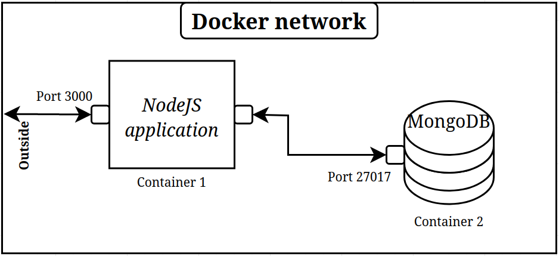

# Getting started with the local TODO App

`setup.md | Version: 15.04.2023 | Author: MfellnerDev`

For the possible commands of this application, see [commands](commands.md).

Please note that the manual guide (`2. Install and run the local Todo App`) is only for Linux-based systems!

If you have a Windows system, installing the application via Docker would be the best solution.

#### For the docker instructions, see the end of this guide.


## 1. Requirements
You will need to install the following requirements on your system:

-> [NodeJS@18.15.0](https://nodejs.org/en/blog/release/v18.15.0) (including `npm`) *[1]*

-> [MongoDB](https://www.mongodb.com/docs/manual/administration/install-community/) *[2]*

-> (if you choose docker) [Install the Docker engine](https://docs.docker.com/engine/install/)

---
*[1]* It theoretically doesn't matter which version of NodeJS you have installed. The 
project was developed and tested under NodeJS@18.15.0.

*[2]* You will need to run a local MongoDB server;

- [Run a local MongoDB Server](https://www.prisma.io/dataguide/mongodb/setting-up-a-local-mongodb-database); 

Follow these instructions.
It is important to note your `MongoDB connection string` as you will
need it for the application.

## 2. Install and run the local Todo App

Now that you have Node and a local MongoDB server running on your system, you can move on to installing and
running the application.

### 2.1 Installing

Clone the repository to your machine:

```shell
$ git clone https://github.com/MfellnerDev/express-localtodo
```

Now you need to install the NodeJS requirements:

```shell
$ cd <project-root-directory>
# Installs requirements for project listed in package.json
$ npm install 
```


*Optional*: Install the dev dependencies:

```shell
$ npm install dev
```

Next, you need to create a `.env` file in the root directory of the project and paste your `MongoDB connection string`
into it.

You can find the "syntax" for this in `.env_example`. 

For example, your `.env` file could look like this:
```shell
MONGODB_CONNECTION_STRING="mongodb://127.0.0.1:27017"
```

The last step is running the application:

```shell
$ npm run start
# You should receive the following output:
# > express-localtodo@1.0 start
# > node ./bin/www

```

Congratulations! You've successfully installed and run the application.

## 3. Docker installation

An easier (and platform-independent) way to install this application is via `Docker`.

The structure is the following:

- Container 1: `express-localdoto` | Runs the NodeJS application
- Container 2: `mongodb` | Runs the MongoDB container
- Docker network: `express-localtodo-network` | This is the docker network that connects Container 1 and Container 2



*Preperation:*
*Before build the container, you have to create a `.env` file in the project root with the following content:

`MONGODB_CONNECTION_STRING="mongodb://mongo:27017"`

*Only if you do this, the NodeJS application will be able to connect to the database.*

### 1. Install docker

As you can see in the `1. Requirements` section, you will need to install the Docker engine for this


### 2. Build the Docker container

The Dockerfile is provided and can be found in `docker/`.

Now, we are going to build the container with `docker build`:

```shell
$ docker build -t express-localtodo .
```

### 3. Create the Docker network

We are using a dedicated Docker network to connect the NodeJS application and the MongoDB database.

Create the network with `docker network`:

```shell
$ docker network create localtodo-network
```

### 4. Start the MongoDB container

The container has to be in the created network.

Start the container with `docker run`:

```shell
$ docker run -d --name mongodb --network localtodo-network
```

### 3. Last but not least, start the NodeJS container

The container needs to be in the created network and, of course, needs it's `3000` port exposed.

```shell
$ docker run -d --name express-localtodo --network localtodo-network -p 3000:3000 express-localtodo
```

**6. Optional:** Execute commands from [commands.md](commands.md)

If you would like to execute commands listed in the [commands.md](commands.md) file, you can do this with the following Docker command:

```shell
# docker exec -it <container_name> <command> 

# For example, the fillDB script:

$ docker exec -it express-localtodo npm run fillDB
```

Just consider the syntax, and you are ready to go.